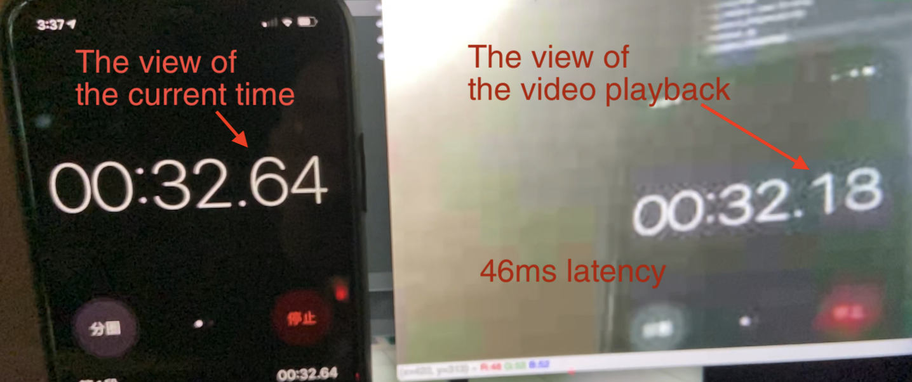

# JPEG Stream
It provides a low bandwidth, low latency video stream service.

## The Purpose
For long-range FPV flight, it doesn't care about the image quality. It provides just enough information to let the pilot knows how to control the plane. The most important thing is that it can provide low latency video and use low bandwidth.

## Low bandwidth
Test streaming video is transmitted at 10FPS at 341 x 256 frames, using a bandwidth of approximately 100 Kb-150 Kb per second. It can stream real-time video in a low bandwidth network. (e.g. a weak signal 4G network)

## Low latency
In actual tests on a weak signal a 4G network, the streaming video latency can be as low as 48ms.

[Demo video](https://www.youtube.com/embed/BpVMlIxjAsc)

## Low CPU load
In actual tests on a Raspberry PI 3, the sender.py script used under 20% CPU load.

## Save high-res. video at same time
It streams the low-resolution video and saves a high-resolution video to file.

---
## Hardware Requirements
### Sender
- Raspberry PI
- Raspberry Pi Camera Module\
(Tested: Raspberry PI 3 and Raspberry Pi Camera v1.3)

### Receiver
- Any machine that can run Python 2 or 3\
(Tested: MacbookPro with Python 3)

## How to strat?
1. Change the TCP_IP setting in the sender.py. Set it to the receiver IP.
2. Start the sender.py on Raspberry PI
3. Start the receiver.py on your PC/Mac
  
## Credit
The original code was created by `Maxcr1`:
https://github.com/Maxcr1/TinyStream
